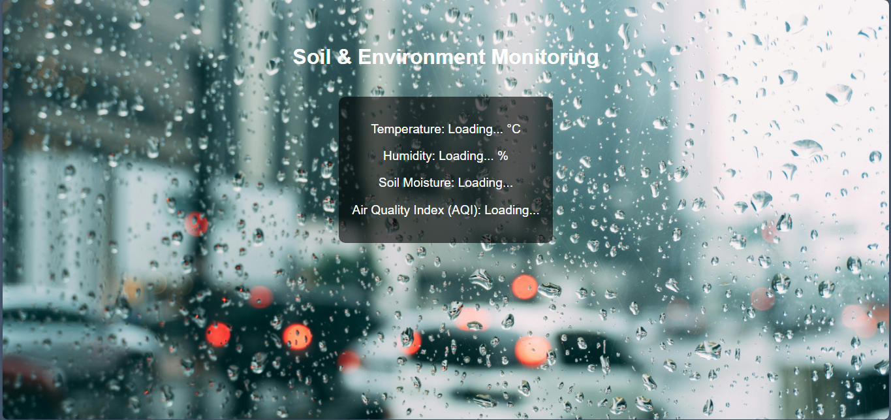

Of course! Here's a complete **README.md** you can directly use for GitHub:

---

# 🌱 Smart Soil and Air Monitoring System

This project is a **WiFi-enabled environmental monitoring system** based on the **ESP32** microcontroller.  
It reads **temperature**, **humidity**, **soil moisture**, and **air quality** data from sensors, and displays it both on a **web page** and through the **Serial Monitor**.

---

## 📋 Features
- Real-time monitoring of:
  - 🌡️ Temperature
  - 💧 Humidity
  - 🌱 Soil Moisture
  - 🏭 Air Quality (using MQ135 sensor)
- Web server hosted directly on the ESP32.
- Live data logging via Serial Monitor.
- Works with standard WiFi networks.
- Low-cost and scalable for smart farming, gardening, and environmental applications.

---

## 🛠️ Components Required
| Component           | Details                            |
|---------------------|------------------------------------|
| ESP32 Board         | WiFi + BLE microcontroller         |
| DHT11 Sensor        | Temperature and Humidity Sensor    |
| Soil Moisture Sensor| Analog soil moisture detector      |
| MQ135 Sensor        | Air Quality (AQI) Sensor           |
| Jumper Wires        | For connections                    |
| Breadboard          | (Optional) For easier setup        |

---

## 📚 Libraries Required

Install these libraries in your Arduino IDE (or PlatformIO):

1. **ESPAsyncWebServer**  
   - For handling the web server on ESP32.
   - GitHub: [ESPAsyncWebServer](https://github.com/me-no-dev/ESPAsyncWebServer)

2. **AsyncTCP**  
   - Backend TCP support library for ESPAsyncWebServer.
   - GitHub: [AsyncTCP](https://github.com/me-no-dev/AsyncTCP)

3. **DHT Sensor Library**  
   - To interface with the DHT11 sensor.
   - Install from Arduino Library Manager or GitHub: [DHT sensor library](https://github.com/adafruit/DHT-sensor-library)

4. **Adafruit Unified Sensor Library**  
   - Dependency for DHT sensor library.
   - GitHub: [Adafruit Unified Sensor](https://github.com/adafruit/Adafruit_Sensor)

> **Note:** `ESPAsyncWebServer` and `AsyncTCP` are essential for the Web Server part. Make sure you install them manually if not available in Library Manager.

---

## 🧩 Circuit Diagram

| Sensor              | ESP32 Pin       |
|---------------------|-----------------|
| DHT11 Data Pin      | GPIO 2           |
| Soil Moisture (Analog Output) | A0 |
| MQ135 (Analog Output) | A1 |
| VCC/GND Connections | 3.3V / GND       |

---

## 🔥 Project Setup

1. Install all the required libraries mentioned above.
2. Connect the hardware as per the circuit diagram.
3. Upload the code to your ESP32.
4. Open Serial Monitor at `115200` baud rate.
5. Connect to your ESP32’s IP address (shown in Serial Monitor) via a web browser to view the live dashboard.

---

## 🌐 How the System Works

- ESP32 reads sensor values every 2 seconds.
- Data is updated and served via an internal **HTTP Web Server**.
- Simultaneously, the readings are logged on the **Serial Monitor**.
- Accessible over the same WiFi network using the device’s local IP address.

---

## 📈 Sample Outputs

**Serial Monitor Output:**
```
Temperature: 25.3 °C, Humidity: 60%, Soil Moisture: 380, AQI Value: 420
```

**Web Page Output:**
```
Environmental Data
Temperature: 25.3 C
Humidity: 60 %
Soil Moisture: 380
Air Quality (AQI Sensor): 420
```

---

## 🚀 Future Improvements
- Add threshold-based alerts via Email/SMS.
- Connect to IoT Cloud platforms like Thingspeak, Blynk, or Firebase.
- Implement automatic irrigation based on soil moisture.
- Improve Air Quality sensor calibration for more accurate readings.

---

## 📝 License
This project is open-source and free to use under the **MIT License**.

---

# 📷 Project Preview


---

Would you also like me to give you a small badge block (for GitHub README) like `Made with Arduino`, `License: MIT`, `ESP32`, etc.? 🚀 It looks great at the top!  
Let me know!