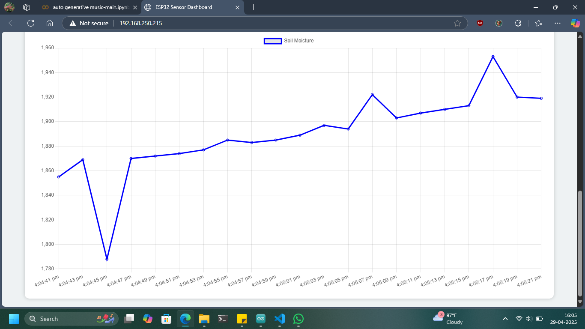

# 🌱 Smart Soil Monitoring System with ESP32

This project is a **WiFi-enabled environmental monitoring system** built entirely on the **ESP32 microcontroller**.  
It reads **temperature**, **humidity**, and **soil moisture** data directly using sensors connected to the ESP32 and displays the readings on a **live web dashboard** and through the **Serial Monitor**.

---

## 📋 Features

- Real-time monitoring of:
  - 🌡️ Temperature
  - 💧 Humidity
  - 🌱 Soil Moisture
- Responsive web dashboard hosted on the ESP32.
- Automatic refresh every 2 seconds.
- Serial output for debugging or data logging.
- Compact, low-cost solution for smart gardening and agriculture.

---

## 🛠️ Components Required

| Component            | Details                         |
| -------------------- | ------------------------------- |
| ESP32 Board          | WiFi + BLE microcontroller      |
| DHT11 Sensor         | Temperature and Humidity Sensor |
| Soil Moisture Sensor | Analog soil moisture detector   |
| Jumper Wires         | For connections                 |
| Breadboard           | (Optional) For prototyping      |

---

## 📚 Libraries Required

Install these libraries in your Arduino IDE:

1. **ESPAsyncWebServer**  
   GitHub: [ESPAsyncWebServer](https://github.com/me-no-dev/ESPAsyncWebServer)

2. **AsyncTCP**  
   GitHub: [AsyncTCP](https://github.com/me-no-dev/AsyncTCP)

> These libraries allow the ESP32 to serve a dynamic, auto-updating web page.

---

## 🧩 Pin Connections

| Sensor                        | ESP32 Pin                             |
| ----------------------------- | ------------------------------------- |
| DHT11 Data Pin                | GPIO 2                                |
| Soil Moisture (Analog Output) | A0 (GPIO 36 or 39 depending on board) |
| VCC/GND Connections           | 3.3V / GND                            |

---

## 🔥 Setup Instructions

1. Wire the sensors to the ESP32 as shown above.
2. Install the required libraries.
3. Upload the ESP32 sketch.
4. Open the Serial Monitor at **115200 baud** to get the local IP address.
5. Open that IP in your browser to view the dashboard.

---

## 🌐 How the System Works

- ESP32 reads sensor values internally.
- Data is served via a simple HTTP server hosted on the ESP32.
- A web interface fetches new data every 2 seconds and updates the values.
- Serial Monitor logs data simultaneously for diagnostics or data logging.

---

## 📈 Sample Outputs

**Serial Monitor:**

```
ESP32 Initialized
Connecting to WiFi...
Connected to WiFi
192.168.1.74
Temperature: 24.7 °C, Humidity: 58 %, Soil Moisture: 340
```

**Web Page Output:**




---

## 📝 License

This project is licensed under the **MIT License**.  
Feel free to use and modify it for personal, educational, or commercial purposes.

---

## 📷 Project Preview


